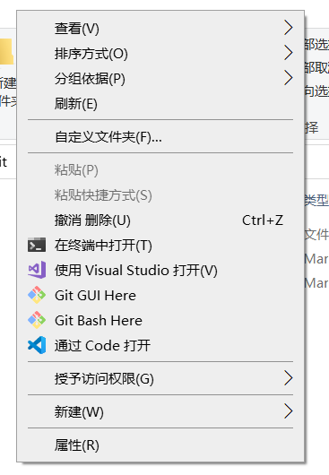
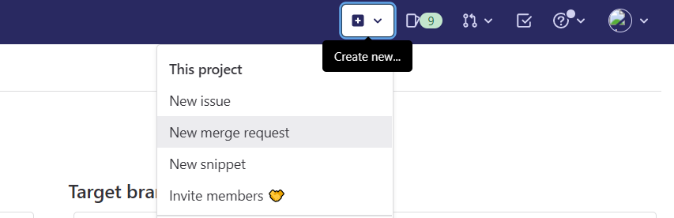
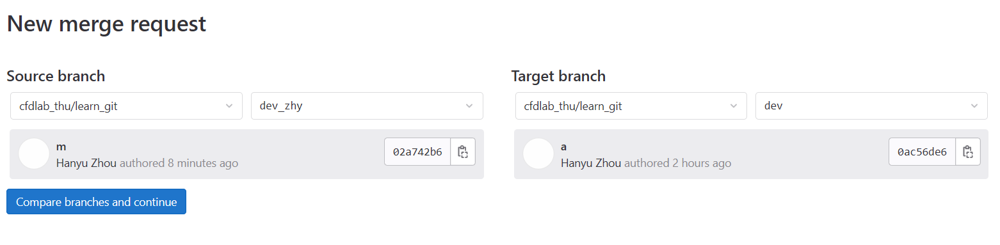
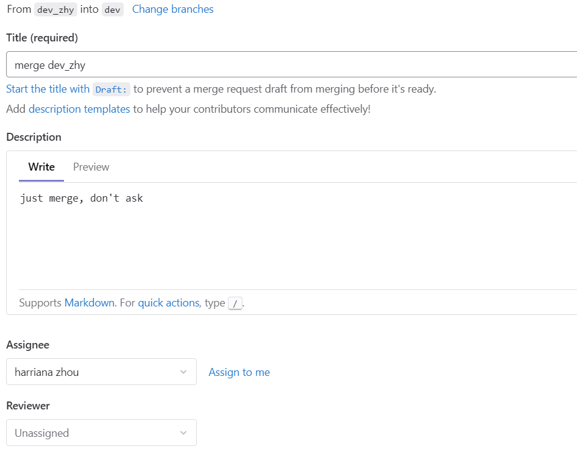

<!-- @import "[TOC]" {cmd="toc" depthFrom=1 depthTo=6 orderedList=false} -->

<!-- code_chunk_output -->

- [关于版本协作的一些简单教程](#关于版本协作的一些简单教程)
  - [1. 推荐的Git操作环境](#1-推荐的git操作环境)
    - [1.1. VsCode的Git操作](#11-vscode的git操作)
  - [2. 从Gitlab clone 项目](#2-从gitlab-clone-项目)
  - [3. 一个简单的Follow Through](#3-一个简单的follow-through)
    - [3.1. 基本信息](#31-基本信息)
    - [3.2. 工作分支](#32-工作分支)
    - [3.3. 在远程repo保存](#33-在远程repo保存)
    - [3.4. 本地临时分支](#34-本地临时分支)
    - [3.5. 合并冲突](#35-合并冲突)
    - [3.6. MR合并到dev分支](#36-mr合并到dev分支)
    - [3.7. pull 与 fetch](#37-pull-与-fetch)
    - [3.8. .gitignore 以及 git lfs](#38-gitignore-以及-git-lfs)

<!-- /code_chunk_output -->

# 关于版本协作的一些简单教程


Git是一种分布式版本管理软件，由Linus开发，它的基本界面是命令行界面。

通过Git，你可以管理某个目录下的所有代码文件，追踪其变化，并且增量地进行保存、同步和合并。

Git有许多基本指令，但是日常使用仅仅使用少数。

这里推荐入门教程：[廖雪峰的Git教程](https://www.liaoxuefeng.com/wiki/896043488029600)，
建议通读并且自己简单尝试。

里面可以了解Git的基本操作。

同时，Git的[官方文档](https://git-scm.com/docs)是查阅详细命令的好地方。

同时有一个很好的[Visual CheatSheet](https://ndpsoftware.com/git-cheatsheet.html)，点击里面的不同区域就可以看到相关的命令。

当然，如果你只是忘记了参数的命令行意义，可以使用

```bash
git --help
git <command> -h
git <command> --help
```

获得命令的帮助或者详细git doc。

本文档要求读者**完全学习**一个[Princeton的教程](https://henryiii.github.io/se-for-sci/content/week6/git.html)

以下的文档，默认读者已经**基本了解并且实践**过git的简单命令（add commit fetch merge push 等），并且清楚至少workspace，index，local repo，upstream的概念。

## 1. 推荐的Git操作环境

我们使用的Linux系统，包括WSL中，只需用包管理器安装Git即可。Windows系统建议安装[Git for Windows](https://gitforwindows.org/)软件，这样就同时安装了Git Bash，一个Windows上面运行的比较接近bash语法的shell。安装包安装时尽量采用Windows环境推荐配置（默认的），尤其是**CRLF相关**。

Windows 11集成了Terminal，Windows 10上面建议从应用商店安装Windows Terminal应用。Windows Terminal应该可以检测到Powershell、CMD、git bash，可以自由选择。同时，资源管理器中右键菜单可以出现“在此处打开Terminal”的选项，方便我们随地进入命令行而不用手动cd/dir到想要的目录。

VsCode是一个强大的文本编辑器，通过扩展可以功能上接近完整的IDE。安装Vscode时，**建议选择将VsCode加入右键菜单**。

资源管理器在文件夹空白处右键菜单如下：



### 1.1. VsCode的Git操作

VsCode可以实现Git的部分图形化操作，对理解分支结构帮助比较大。VsCode内置了一部分Git辅助功能。

首先，在左侧工具栏可以找到Source Control栏目，如果VsCode的工作根目录属于一个Git Repo，即有完整的.git文件夹内容（如clone下来，或者自己init的），这时Source Control栏目会显示Staged Changes，以及Changes的情况，点击每个文件名可以打开一个对比的双列文件，用来显示有哪些修改。

其次，在代码中会显示workspace文件与index的差别，在左侧以**彩色竖条呈现**。绿色代表新加内容，蓝色是修改内容，红色是删除内容。单击左侧的彩色条可以观察此处发生了什么修改。这些修改和Source Control中在Changes栏目点击看到是一致的。

虽然VsCode的Git功能提供了add、commit、push、sync的按钮，但是本文**不建议**直接使用，实际的Git操作尽量在命令行执行，除非你**对Git很熟悉**而且**对这个图形界面执行的是哪些Git操作很熟悉**。其他Git图形界面同理。时刻牢记，虽然Git操作不会损坏repo里面的commit，绝大多数git指令后，无论如何都能恢复之前的commit，但是git对你workspace的代码有**全部权限**，误操作可能导致**新写的workspace代码丢失或者损坏**，可能一上午就白干了。*所以，一般的推荐是任何对git操作之前，进行add-commit操作或者stash操作，清空workspace changes。*

VsCode可以安装很多Git相关扩展，功能都很强大，但是简单入门+小团队应用时，可以完全不使用。唯一*推荐安装的是Git Graph，可以直接应用商店搜索得到，用来观察分支情况、commit情况，或者比较两个commit的差异*。

有其他诸如Tower等专门的git GUI管理软件，本文不作推荐，且如上建议首先熟练掌握工作中常用的git console命令。

## 2. 从Gitlab clone 项目

你看到这里时已经向Gitlab group的管理员申请了加入群组，才能看到群组私有项目。单击代码首页的clone，就可以发现有不同选项。这里推荐SSH方式。

首先设置账户的SSH授权，Windows下生成SSH的密钥后，将公钥文本拷贝到Gitlab个人账户设置界面的对应位置，你的Windows上的git即可通过SSH与Gitlab的repo通信。

随后拷贝clone按钮给出的SSH版本的URL，类似于

```bash
git@gitlab.com:cfdlab_thu/learn_git.git
```

这样，打开Windows的一个shell（此处以git bash为例）：

```bash
/e/projects/$ git clone git@gitlab.com:cfdlab_thu/learn_git.git
```

那么项目的完整目录就出现在/e/projects/learn_git。

## 3. 一个简单的Follow Through

本节简单示范如何日常对代码进行编辑，使用git管理changes，并作为project的developer配合Gitlab repo使用。

你可以在每一步操作之后，用VsCode的Git Graph插件查看当前的状态，包括commit情况、各branch的指向位置等。

### 3.1. 基本信息

假定你已经clone了本项目，并且控制台的工作目录其根目录下（本文假设使用的是windows的git bash操作，UNIX bash等输出类比）：

```bash
ls -a
./  ../  .git/  .gitignore  GitBasics.md  pics/  README.md
```

同时我们查看一下当下的情况：

```bash
$ git branch
  dev
* main
$ git remote show
origin
$ git remote show origin
* remote origin
  Fetch URL: git@gitlab.com:cfdlab_thu/learn_git.git
  Push  URL: git@gitlab.com:cfdlab_thu/learn_git.git
  HEAD branch: main
  Remote branches:
    dev  tracked
    main tracked
  Local branches configured for 'git pull':
    dev  merges with remote dev
    main merges with remote main
  Local refs configured for 'git push':
    dev  pushes to dev  (up to date)
    main pushes to main (up to date)
```

上面的查询命令看出，我们有两个远程分支。

注意，作为developer，我们没有权限真正对以上显示的dev，main分支进行push，其在项目为protected状态，因此我们本地的修改完全不可能影响远程的dev分支。只有maintainer和owner权限才可以直接对其push。因此，我们基本的开发思路是，所有个人开发代码都提交到个人分支。**本实验室的推荐是，开发分支命名规则为**"dev_\<feat>_\<name>，或者至少是"dev\<feat>"，比如"dev_mesh_zhy"或者"dev_mesh"。同时，当你遇到**别人正在开发的分支**时（你自己不熟悉的分支名等），请不要修改并且向其push，避免打搅别人的工作。

如果你是maintainer或者owner，你需要在日常开发时注意不对dev或者main进行push，也遵循developer的守则，除非你在进行版本整理等重大工作。

### 3.2. 工作分支

接下来，假设你想要开始写代码，先切换到dev分支，这里是最新的经过验证（但是还没有发布）的代码，一般从dev分支开始个人的开发。之后建立**工作分支**。这里命名为dev_zhy，则：

```bash
$ git switch dev
Switched to branch 'dev'
M       .gitignore
Your branch is up to date with 'origin/dev'.
$ git switch -c dev_zhy
Switched to a new branch 'dev_zhy'
(base)
```

你也可以用git branch命令创建分支，而上述命令则同时切换过去。本文推荐所有分支切换使用git switch，而老用法中的git checkout只用来checkout个别文件而不用来日常切换分支。

### 3.3. 在远程repo保存

创建文件，比如code_HarryZhou.txt，并且写入一些东西：

```bash
$ touch code_HarryZhou.txt 
$ echo "my first line!" >> code_HarryZhou.txt 
```

这时你结束了一天的工作，那么最好进行stage：

```bash
$ git add code_HarryZhou.txt 
warning: LF will be replaced by CRLF in code_HarryZhou.txt.
The file will have its original line endings in your working directory
```

由于我们在Windows系统上面进行编写，windows上面存储的是CRLF行尾，git会进行自动转换。UNIX系统上面都采用LF行尾。VsCode可以清晰分辨行尾情况。

再进行commit：

```bash
$ git commit -m 'my first day commit, added a line!'
<some info about commit>
```

这时代码更改被git安全记录下来。但是，假如你担心自己的电脑坏掉，或者突然需要在其他地方写代码，将其push到远程是一个好方案。作为developer，你可以创建新分支，这意味着你可以做如下操作：

```bash
$ git push -u origin dev_zhy
<some info about push>
```

这时，我们的公共repo（被标记为origin，可用git remote show查看）就建立的一个新的分支dev_zhy，本地的标记是origin/dev_zhy。同时，将其设置为本地dev_zhy的upstream。很明显这不是一个protected分支，因此你有权限对其push。下次在dev_zhy上面进行commit后，直接输入：

```bash
$ git push
```

我们强调，虽然developer可以任意创建分支，但是不建议为太多的本地分支创建公共repo的分支，这样会造成其比较混乱。如果你有一些个人开发的中间分支，最好保存到其他地方，比如私有的仓库。下面我们演示怎样在远程私有仓库进行push。

假设你想要将（很多分支的）代码备份到自己的私有仓库，假设你创建了GitHub的空仓库：

```bash
git@github.com:harryzhou2000/learn_git
```

首先将其添加为一个名叫github_backup的remote repo：

```bash
$ git remote add github_backup git@github.com:harryzhou2000/learn_git
```

之后进行push即可：

```bash
$ git push github_backup dev_zhy
```

push的-u参数用来设置默认upstream，如果固定要push到这里，那么可以加上-u，下次在dev_zhy分支上可以直接push或者pull。下文都假定dev_zhy分支的默认upstream都还是origin/dev_zhy。

以上的机制说明你可以添加多个remote进行上传，你甚至可以在本机、U盘、实验室服务器和不同托管平台设置多个remote repo，每次备份的时分别push。

### 3.4. 本地临时分支

第二天，你打算继续写一些代码：

```bash
$ echo "hack hack hack!" >> code_HarryZhou.txt
$ echo "bug bug bug!" >> code_HarryZhou.txt
```

很不幸，你的代码出现了~~字面意义上的~~bug。解决这个bug是个独立的过程，我们不想将其与dev_zhy中已有的优秀代码相混淆。这时你可以**直接创建一个新分支并切换**：

```bash
$ git switch -c debug 
```

注意，切换到新分支的动作不会影响workspace以及index内的内容，因此你不必担心刚刚的工作丢失。如果不放心，你可以先进行stash避免丢失，或者事先add、commit，将bug保存起来（获得git status展示nothing to commit, working tree clean)：

```bash
$ git add -A
$ git commit -m 'bug!'
```

之后，经过一系列操作你发现了bug：

```bash
$ echo "debug debug debug!" >> code_HarryZhou.txt
```

之后可以高兴地：

```bash
$ git add -A
$ git commit -m 'bug dealt with!'
```

这时，debug分支相比于dev_zhy分支前进了很多。进行merge：

```bash
$ git switch dev_zhy
$ git merge debug
Updating 4a03fae..5c5eafb
Fast-forward
 code_HarryZhou.txt | 3 +++
 1 file changed, 3 insertions(+)
```

可以看到输出中是Fast-Forward，这是因为此时dev_zhy指向的commit是debug指向的commit的*祖先*，而没有发生分叉的拓扑。这时，dev_zhy只是简单地指向了debug的位置，而没有进行实际的commit。

由于问题完全解决，删除debug分支：

```bash
$ git branch -d debug
```

具体怎样使用或者不使用临时分支，本文不作具体要求，最理想的情况是个人的代码开发完全是线性的。这一小节只是作为学习的例子，并且作为一种可能有用的实际场景。


### 3.5. 合并冲突

接下来你想要写一个很复杂的东西叫做fun，涉及多达2行代码。假设我们一次只能写一行，那么最好将只写了一半的这种commit放到临时分支里面，

因此，如上一小节，建立临时分支write_fun并写：

```bash
$ git switch -c write_fun
$ echo "fun1" >> code_HarryZhou.txt
$ git add -A
$ git commit -m 'write fun1'
$ echo "fun2" >> code_HarryZhou.txt
$ git add -A
$ git commit -m 'write fun2'
```

然后进行了备份（如向github_backup进行了push），之后心满意足地睡觉去了。第二天，老板加急催促一个功能，但是你的fun还没有测试，因此你打算在原来写fun的地方写一个凑合的版本ffuunn，并且决定在dev_zhy分支下面一步完成。首先切换回dev_zhy：

```bash
$ git switch dev_zhy
```

注意切换前workspace没有任何东西（无change，和write_fun分支最新的commit完全一样，nothing to commit, working tree clean），这样没有丢失工作的可能。你会发现切换后代码文件变成了dev_zhy的状态，此时还没有写fun。

```bash
$ echo "ffuunn" >> code_HarryZhou.txt
$ git add -A
$ git commit -m 'write ffuunn'
```

这时可以通过switch来对比两个分支下代码的区别。此后，你完成了fun的测试，需要将其合并到dev_zhy，就在dev_zhy分支下执行：

```bash
$ git merge write_fun 
Auto-merging code_HarryZhou.txt
CONFLICT (content): Merge conflict in code_HarryZhou.txt
Automatic merge failed; fix conflicts and then commit the result.
```

首先，git检测到文件经历了不同的修改，因此需要进行merge。首先git尝试进行auto merging，具体算法见文档。自动merge一般可以将相同的修改直接合并，而此处明显不行。因此产生了一些需要手动merge解决冲突的内容，git status可以看到每个需要手动解决冲突的文件，其都被放入工作区并被标记为both modified。

编辑器打开代码，可以发现其内容如下：

```txt
my first line!
hack hack hack!
bug bug bug!
debug debug debug!
<<<<<<< HEAD
ffuunn
=======
fun1
fun2
>>>>>>> write_fun
```

传统上需要手动修改，得到你想要的结果，假如fun的写法是正确的，手动修改：

```txt
my first line!
hack hack hack!
bug bug bug!
debug debug debug!
fun1
fun2
```

VsCode提供了较为方便的冲突比较界面，解决冲突，减少大量手动修改，也可以较好防止忽略merge位置的可能。

此后将解决完冲突的文件stage加入index，并且commit：

```bash
$ git add -A
$ git commit -m 'merged'
```

这样dev_zhy指向了一个合并的commit。**注意此时write_fun还指向合并前的commit，而非合并后的**。

### 3.6. MR合并到dev分支

写了很多代码之后，我们认为这些代码应该被合并到dev分支，被其他开发者利用了（而且预测不会给他们带来麻烦）。我们可以在dev上merge dev_zhy，但是没有办法push到origin/dev，因为权限不够。毕竟这是一个比较重要的事情，最好交给maintainer或者owner去做。这就涉及了Merge Request（MR）。Github将其称为Pull Request，道理一样，因为pull=fetch + merge。

首先我们确保origin/dev_zhy是最新的本地dev_zhy，在dev_zhy使用：

```bash
$ git push
```

输出其实提示了创建MR的网址，我们不妨手动。进入Gitlab的project界面，在页面上方点击New merge request：



然后选择正确的source和target branch：



填写一些必要信息以及说明，接下来，假设团队成员harriana_zhou有向dev分支merge（push）的权限，不妨将她加入Assignee，这样她就会接到通知来看看。任何有权限的成员实际上都可以最后决定merge的实施，Assignee不一定要有权限执行merge。一般建议至少填写Assignee并且通知她进行审核。



经过审核和讨论，并且进行comment、测试之后，你的MR可以被有权限的用户执行。这样代码就真正跑到了dev上。

此时执行pull：

```bash
$ git switch dev
$ git pull
```

即可得到最新的dev。关于MR的进一步信息见[Gitlab手册](https://docs.gitlab.com/ee/user/project/merge_requests/)。

此时建议删除原有的分支dev_zhy，在新的dev上面重建。当然假如要接着这个话题进行开发，或者单纯不希望更改这些，更加方便的是在dev_zhy上面merge dev即可，假如中间你没有进行进一步开发，merge是可以直接进行的。

### 3.7. pull 与 fetch

上文的场景中，每次远程repo发生更新，我们都是通过在dev或者main的pull进行。由于我们不在上面开发，这些pull总是trivial的fast-forward。但是假如我们在dev_zhy上开发，期间远程的origin/dev_zhy被更改（比如在另外一个电脑进行了不同开发），那么pull的时候会发生merge。

拆解开来，就是先进行fetch，将远程库的信息同步到本地存储的origin/dev_zhy，再merge origin/dev_zhy。

**更保险的推荐**是先进行fetch，再通过git diff或者VsCode的功能（如在git graph中ctrl点击两个commit）审阅所有的不同后再进行merge。

### 3.8. .gitignore 以及 git lfs

项目编译链接会产生大量中间文件，以及运行文件。本文规定，对于c/c++/fortran项目，**UNIX环境下或者windows的mingw环境下所有编译二进制对象文件都以.o结尾**，**VS项目按照默认**，方便以wildcard加入.gitignore。同时**所有的可执行文件都必须加入.gitignore**，因为别人不会复用这些文件。

当然，有一个突出的问题是，CFD开发中项目内部常常存在网格文件，其为二进制（或者准二进制）数据，不宜保存所有的版本增量，因此最好使用git lfs。

git lfs在linux的包管理器上面安装很简单，在windows下通常也和git for windows捆绑安装。第一次使用时，在仓库内进行：

```bash
$ git lfs install
```

假设之前没有任何的git lfs追踪模式，而我们加入了一个gmsh文件：

```bash
$ touch a_big_mesh.msh
```

我们进一步让git lfs知道这个是个网格文件，不作增量更新，则：

```bash
$ git lfs track "*.msh"
Tracking "*.msh"
$ git lfs track
Listing tracked patterns
    *.msh (.gitattributes)
Listing excluded patterns
```

可以看见已经追踪了*.msh。这里**必须使用双引号，否则会产生多条具体的track而非通配track pattern**。随后commit并push（假设在dev_zhy分支，upstream为origin/dev_zhy）：

```bash
$ git add .
$ git commit -m 'added a gmsh file'
$ git push
Locking support detected on remote "origin". Consider enabling it with:
  $ git config lfs.https://gitlab.com/cfdlab_thu/learn_git.git/info/lfs.locksverify true
Enumerating objects: 9, done.
Counting objects: 100% (9/9), done.     
Delta compression using up to 12 threads
Compressing objects: 100% (4/4), done.  
Writing objects: 100% (7/7), 16.92 KiB | 1019.00 KiB/s, done.
Total 7 (delta 0), reused 0 (delta 0), pack-reused 0
remote: 
remote: To create a merge request for dev_zhy, visit:
remote:   https://gitlab.com/cfdlab_thu/learn_git/-/merge_requests/new?merge_request%5Bsource_branch%5D=dev_zhy
remote:
To gitlab.com:cfdlab_thu/learn_git.git
   7a65b3e..85c08da  dev_zhy -> dev_zhy
```

可见确实与git lfs相关。由于gitlab项目支持了lfs功能，这里push成功了。

再添加一些实际的gmsh文件，共有4M大小，commit并且push后：

```bash
$ git add .
$ git commit -m 'added some bulky gmsh files'
$ git push
Locking support detected on remote "origin". Consider enabling it with:
  $ git config lfs.https://gitlab.com/cfdlab_thu/learn_git.git/info/lfs.locksverify true
Uploading LFS objects: 100% (2/2), 4.3 MB | 192 KB/s, done.
Enumerating objects: 5, done.
Counting objects: 100% (5/5), done.
Delta compression using up to 12 threads
Compressing objects: 100% (4/4), done.
Writing objects: 100% (4/4), 566 bytes | 566.00 KiB/s, done.
Total 4 (delta 1), reused 0 (delta 0), pack-reused 0
remote: 
remote: To create a merge request for dev_zhy, visit:
remote:   https://gitlab.com/cfdlab_thu/learn_git/-/merge_requests/new?merge_request%5Bsource_branch%5D=dev_zhy
remote:
To gitlab.com:cfdlab_thu/learn_git.git
   85c08da..d0b7631  dev_zhy -> dev_zhy
```

可见有实际的LFS文件传输过程。

上述配置过程中产生或者修改了.gitattributes文件，它是一个git的配置文件，可以手动修改git lfs相关配置。

lfs管理的文件在merge中不会进行比较，而是直接覆盖为最新的。假如你不想某个网格被意外覆盖需要加锁，具体可见[知乎教程](https://zhuanlan.zhihu.com/p/146683392)。
